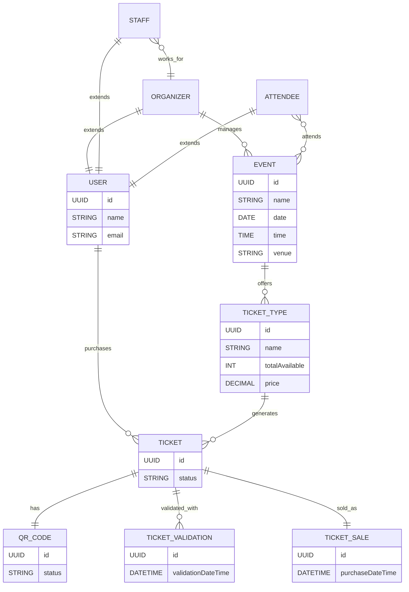

```mermaid
erDiagram

    USER {
        UUID id
        STRING name
        STRING email
    }

    ORGANIZER
    STAFF
    ATTENDEE

    EVENT {
        UUID id
        STRING name
        DATE date
        TIME time
        STRING venue
    }

    TICKET_TYPE {
        UUID id
        STRING name
        INT totalAvailable
        DECIMAL price
    }

    TICKET {
        UUID id
        STRING status
    }

    QR_CODE {
        UUID id
        STRING status
    }

    TICKET_VALIDATION {
        UUID id
        DATETIME validationDateTime
    }

    TICKET_SALE {
        UUID id
        DATETIME purchaseDateTime
    }

    USER ||--o{ TICKET : purchases

    ORGANIZER ||--o{ EVENT : manages

    EVENT ||--o{ TICKET_TYPE : offers

    TICKET_TYPE ||--o{ TICKET : generates

    TICKET ||--|| QR_CODE : has

    TICKET ||--o{ TICKET_VALIDATION : validated_with

    TICKET ||--|| TICKET_SALE : sold_as

    ORGANIZER ||--|| USER : extends
    STAFF ||--|| USER : extends
    ATTENDEE ||--|| USER : extends

    STAFF }o--|| ORGANIZER : works_for

    ATTENDEE }o--o{ EVENT : attends
```